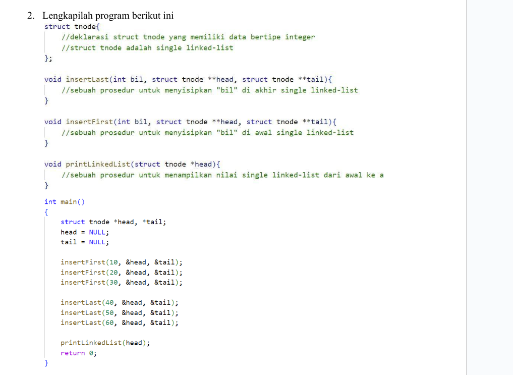

# Proyek Linked List Sederhana

Proyek ini adalah implementasi sederhana dari single linked list dalam bahasa C. Proyek ini mencakup beberapa fungsi dasar untuk menyisipkan elemen di awal dan akhir linked list serta menampilkan elemen-elemen dari linked list tersebut.

## Soal 


## Struktur Proyek

- `main.c`: Berisi kode sumber utama untuk implementasi linked list.
- `README.md`: Berkas ini yang menjelaskan tentang proyek.
- `screenshots`: Folder yang berisi tangkapan layar dari hasil eksekusi program.

## Fitur

1. **insertFirst**: Menyisipkan elemen di awal linked list.
2. **insertLast**: Menyisipkan elemen di akhir linked list.
3. **printLinkedList**: Menampilkan semua elemen dalam linked list dari awal hingga akhir.

## Cara Menggunakan

1. **Kompilasi Program**: Gunakan perintah berikut untuk mengkompilasi program:
    ```sh
    gcc main.c -o main.exe
    ```

2. **Jalankan Program**: Setelah kompilasi berhasil, jalankan program dengan perintah:
    ```sh
    ./main.exe
    ```

3. **Hasil Eksekusi**: Program akan menampilkan linked list yang telah diisi dengan beberapa elemen. Berikut adalah contoh hasil eksekusi:
    ```
    30 -> 20 -> 10 -> 40 -> 50 -> 60
    ```

## Langkah-langkah untuk Clone Project

1. **Clone Repository**: Clone repository ini dari GitHub dengan perintah berikut:
    ```sh
    git clone https://github.com/TudeOrangBiasa/linked-list-c.git
    ```

2. **Masuk ke Direktori Proyek**: Pindah ke direktori proyek yang telah di-clone:
    ```sh
    cd linked-list-c
    ```

3. **Ikuti Langkah-langkah Penggunaan**: Ikuti langkah-langkah yang telah dijelaskan di bagian "Cara Menggunakan" mengkompilasi, dan menjalankan program.

